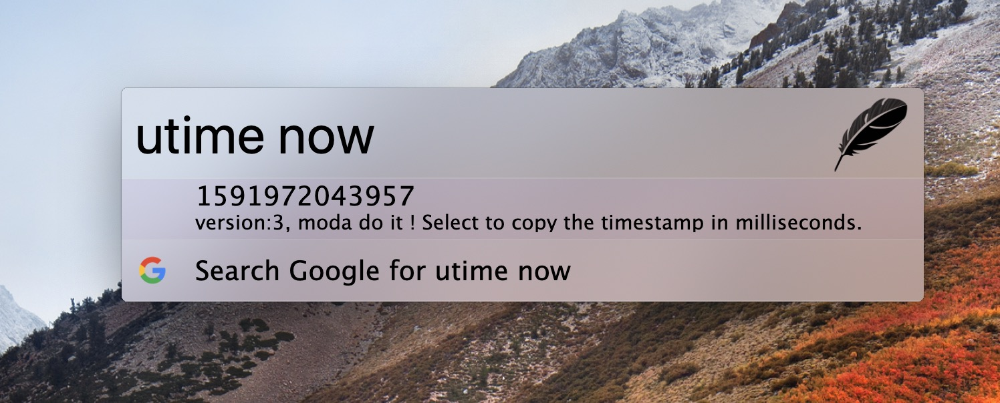
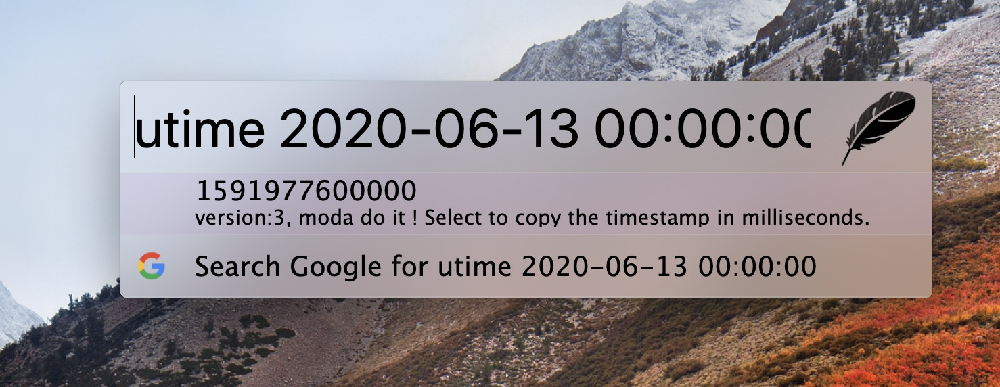
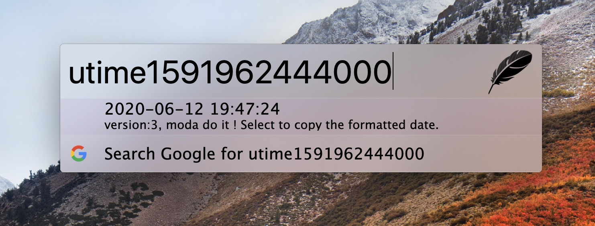
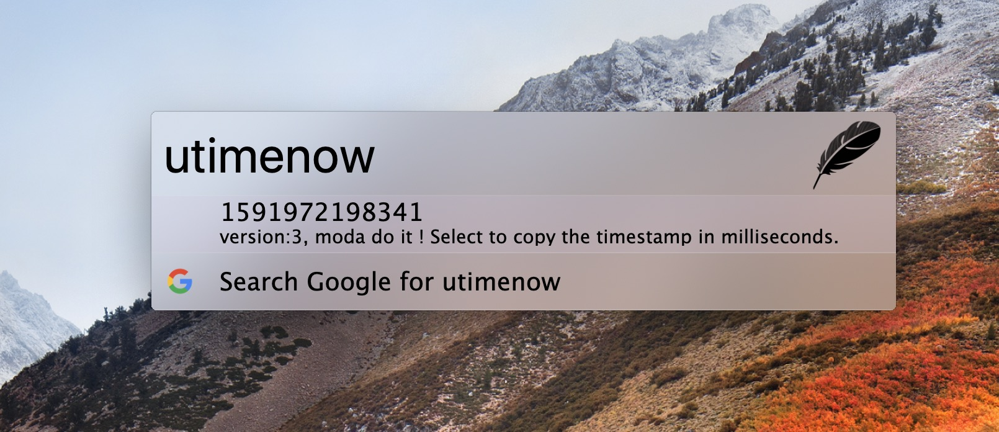

this repo is forked from puyt/zazu-utime, the result of puyt/zazu-utime always displayed first. Therefore, I added the prifix 'utime' on the basis of previous.

## Zazu-utime

A simple timestamp plugin for [Zazu](http://zazuapp.org/), inspired by this [Chrome extension](https://chrome.google.com/webstore/detail/kpcibgnngaaabebmcabmkocdokepdaki).

## Usage

Open Zazu and type a timestamp or human-readable date, the plugin will try and translate most of it.

Examples:
- `utimenow`
- `utime now`
- `utime today`
- `utime1487718000`
- `utime2020-06-13 00:00:00`

For more examples see https://sugarjs.com/dates/#/Parsing

## Installing

Add `xxxtai/zazu-utime` inside of `plugins` block of your  `~/.zazurc.json` file.

~~~ json
{
  "plugins": [
      "xxxtai/zazu-utime"
  ]
}
~~~

### Variables
- `timestampUnit`: seconds or milliseconds
- `outputFormat`: see https://sugarjs.com/dates/#/Formatting for all possible options

~~~ json
{
  "plugins": [
    {
        "name": "xxxtai/zazu-utime",
        "variables": {
            "timestampUnit": "milliseconds",
            "outputFormat": "{yyyy}-{MM}-{dd} {HH}:{mm}:{s}"
        }
    }
  ]
}
~~~

## Screenshots

## Acknowledgments
Most of the plugin it's :muscle: is coming from [Sugarjs](https://sugarjs.com/)

## See also
- [`tinytacoteam/zazu`](http://github.com/tinytacoteam/zazu)

## License

[MIT](LICENSE.md)
